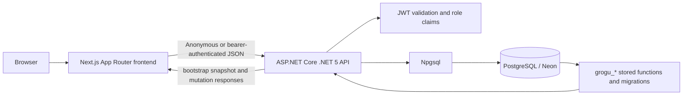
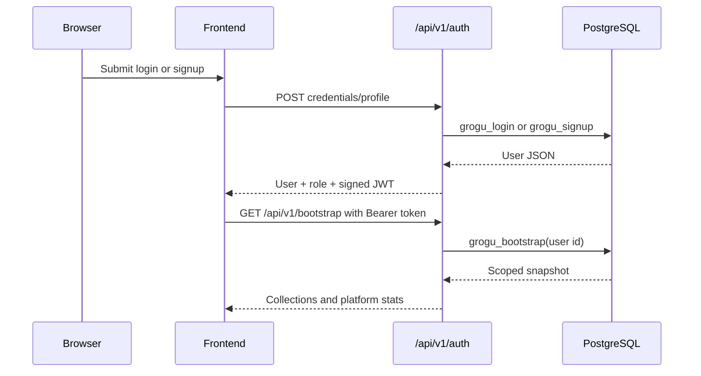

# Project Grogu

**A two-sided playtesting platform that helps indie developers learn from real players before a game ships.**

Project Grogu connects developers who need actionable feedback with testers who want to discover unreleased games, participate in structured playtests, and build a record of useful testing work. This repository contains the Next.js frontend. The companion [`Grogu_backend`](../Grogu_backend) directory contains the .NET API and PostgreSQL database migrations.

## Overview

Game teams often have access to friends or internal testers, but not to a repeatable pool of players with the right platforms, genres, experience, and availability. Feedback can arrive late, be difficult to compare, or lack the context needed to turn it into a development decision.

Grogu organizes that loop in one product:

- Developers publish a game and a playtest brief with goals, requirements, tasks, and a reward.
- Testers discover recruiting playtests, apply with a message, and track their applications.
- Developers review applicants, accept a roster, and receive structured feedback and analytics.
- Testers complete a gated workspace flow: download the build, complete tasks, and submit feedback.

## Who It Is For

| User | Need | Workflow |
| --- | --- | --- |
| Indie developers and small studios | Recruit relevant players and turn play sessions into comparable feedback | Create a game, publish a playtest, manage applicants, review feedback, inspect analytics |
| Dedicated playtesters | Find interesting games and make testing effort visible | Discover playtests, apply, complete accepted tests, submit reports, maintain a profile |

## How It Works

```mermaid
flowchart LR
    A[Tester discovers recruiting playtest] --> B[Tester submits application]
    B --> C[Developer reviews applicants]
    C -->|Accept| D[Tester receives accepted test]
    D --> E[Download build and complete tasks]
    E --> F[Submit structured feedback]
    F --> G[Developer reviews feedback and analytics]
    G --> H[Improve the next game build]
```



### Tester journey

1. Browse public playtests from the landing page or **Discover**.
2. Open a playtest detail page and apply as a tester.
3. Track pending, accepted, rejected, or withdrawn applications.
4. Open an accepted test workspace, record build download progress, and complete required tasks.
5. Submit ratings, sentiment, written observations, bugs, task answers, hours played, and recommendation.
6. Review testing history, reputation, badges, preferences, and profile information.

### Developer journey

1. Create a developer account and maintain a studio profile.
2. Create and edit games with genre, platform, status, build version, and cover treatment.
3. Create a playtest covering the game, goals, focus areas, requirements, tasks, reward, capacity, and closing date.
4. Save a draft or publish it for recruitment.
5. Review applicants, accept or reject them, and monitor the accepted roster.
6. Inspect feedback, playtest analytics, and cross-playtest trends.

## Implemented Features

### Public product experience

- Landing page with featured playtests, featured games, platform information, and separate developer/tester value propositions.
- Public **How it works**, **For developers**, and **For gamers** pages.
- **Discover** search, sorting, genre, platform, time, and NDA filters.
- Public playtest detail pages with goals, focus areas, requirements, tasks, reward, capacity, and developer information.

### Authentication and authorization

- Email/password login and role-select signup for testers and developers.
- Seeded demo-account actions appear on the login screen after the matching backend migration is applied; credentials are intentionally not documented here.
- The API returns a signed bearer token. The browser stores the token locally and sends it on authenticated requests.
- Route guards keep tester and developer areas separate.
- The backend validates ownership and permissions instead of relying only on client-side checks.

### Tester workspace

- Dashboard, applications with withdrawal, accepted tests, and testing progress.
- Workspace progression from build download to task checklist to feedback submission.
- Structured feedback with five ratings, sentiment, summary, highlights, pain points, bugs, task answers, recommendation, and hours played.
- Tester profile and editable preferences, experience, platforms, genres, languages, and availability.
- Rewards view for reward-related testing context. Payment or reward fulfilment is not integrated.

### Developer workspace

- Dashboard with studio stats, active playtests, roster progress, and recent feedback.
- Game catalogue with create/edit flows, deterministic procedural cover art, and metadata.
- Playtest catalogue with status views and a multi-step create/edit-draft wizard.
- Playtest management tabs for overview, applicants, testers, feedback, and analytics.
- Applicant decisions and playtest lifecycle status controls.
- Per-playtest and cross-playtest analytics using Recharts, including ratings, sentiment, bugs, pain points, response rate, and playtime.
- Studio profile and editable studio details.

## System Architecture



The frontend is API-integrated, not driven by a local mock database. [`lib/types.ts`](lib/types.ts) is the domain contract. The backend v1 controllers pass JSON request bodies to PostgreSQL functions and return the database-produced JSON shape.

### Frontend data flow

1. Server-rendered public pages read the anonymous public slice through `data/index.ts`.
2. `GroguProvider` loads `GET /api/v1/bootstrap` into a Zustand store.
3. Selector hooks in `lib/hooks/use-grogu.ts` join users, games, playtests, applications, feedback, and progress into view models.
4. Components read through hooks and write through `lib/services/*`; they do not mutate the store directly.
5. Mutations merge returned entities immediately and refresh the snapshot so counts, notifications, progress, and server state remain current.

The bootstrap response is scoped by the bearer token. Anonymous callers receive public collections; signed-in callers receive their own private records plus data needed for playtests they own. The store persists only the session.

### Authentication flow



The API uses bcrypt-backed password verification in the database migrations and JWT bearer authentication in ASP.NET Core. Logout discards the client token; tokens are stateless and expire rather than being revoked server-side.

## API Surface

The frontend uses these v1 endpoints through `lib/services/http.ts`:

| Area | Endpoints |
| --- | --- |
| Authentication | `POST /api/v1/auth/signup`, `POST /api/v1/auth/login`, `GET /api/v1/auth/session`, `POST /api/v1/auth/logout` |
| Bootstrap | `GET /api/v1/bootstrap` |
| Games | `POST /api/v1/games`, `PATCH /api/v1/games/{id}` |
| Playtests | `POST /api/v1/playtests`, `PATCH /api/v1/playtests/{id}`, `POST /api/v1/playtests/{id}/status`, `POST /api/v1/playtests/{id}/applications` |
| Applications | `POST /api/v1/applications/{id}/withdraw`, `POST /api/v1/applications/{id}/decision` |
| Tester tests | `POST /api/v1/tests/{playtestId}/download`, `POST /api/v1/tests/{playtestId}/tasks/{taskId}/toggle`, `POST /api/v1/tests/{playtestId}/feedback` |
| Notifications | `POST /api/v1/notifications/{id}/read`, `POST /api/v1/notifications/read-all` |
| Profiles | `PATCH /api/v1/profile` |

Errors are returned as `{ "message": "...", "code": "..." }` and mapped to `ServiceError`. Database functions enforce playtest ownership, accepted-roster access, capacity limits, lifecycle transitions, and one feedback submission per tester per playtest.

## Tech Stack

| Layer | Technologies |
| --- | --- |
| Frontend | Next.js 16 App Router, React 19, TypeScript strict mode, Turbopack |
| UI | Tailwind CSS v4, Radix primitives, shadcn-compatible components, Lucide React, Motion |
| Forms and validation | React Hook Form, Zod, `@hookform/resolvers` |
| Client state | Zustand cache of the server bootstrap snapshot |
| Analytics | Recharts |
| Backend | ASP.NET Core Web API on .NET 5, C# |
| Data access | Npgsql with direct PostgreSQL function calls |
| Database | PostgreSQL, with Neon supported by the repository configuration |
| Authentication | JWT bearer tokens; bcrypt password hashes are prepared by SQL migrations |
| API documentation | Swagger/OpenAPI exposed by the backend |
| Tooling | npm, ESLint, TypeScript, GitHub Actions |

No payment provider, email provider, realtime service, image host, or AI service is required by the current frontend workflow.

## Project Structure

```text
Project-Grogu/
+-- Project-Grogu-Frontend/       # This Next.js application
|   +-- app/                      # App Router routes and role layouts
|   +-- components/               # UI primitives and domain features
|   +-- data/                     # Server-component accessors for public data
|   +-- lib/
|   |   +-- services/             # HTTP API client and mutations
|   |   +-- store/                # Zustand bootstrap/session cache
|   |   +-- hooks/                # Selectors and auth guards
|   |   +-- domain.ts             # Pure joins, filters, and aggregates
|   |   +-- types.ts              # Frontend/backend domain contract
|   |   +-- constants.ts          # Labels and navigation metadata
|   +-- docs/                     # Architecture, data, routes, and status notes
|   +-- public/                   # Static assets; no committed media currently
+-- Grogu_backend/
  +-- Grogu_backend/            # .NET API, v1 controllers, JWT, Npgsql
  +-- db/migrations/            # Ordered PostgreSQL schema and functions
  +-- docs/                     # Deployment and operations guidance
```

The frontend route groups are `(marketing)`, `(auth)`, `(tester)`, and `(developer)`. Route groups provide layouts without appearing in URLs. See [`docs/routes.md`](docs/routes.md) for the complete route list.

## Getting Started

### Prerequisites

- Node.js 20 or newer and npm.
- .NET 5 SDK, or Docker, for the backend.
- A PostgreSQL database. Neon is supported, but any compatible PostgreSQL instance can be used locally.
- `psql` or another PostgreSQL client to apply migrations.

### 1. Configure and start the backend

From the repository root:

```bash
cd Grogu_backend
export ConnectionStrings__NeonDBConnection="your-postgres-connection-string"
export Jwt__Key="your-random-signing-key-at-least-32-characters"
export Cors__AllowedOrigins__0="http://localhost:3000"
```

Apply the ordered migrations before starting the API:

```bash
for migration in db/migrations/*.sql; do
  psql "$DATABASE_URL" -v ON_ERROR_STOP=1 -f "$migration" || break
done
```

Use your own `DATABASE_URL` or replace it with the connection variable used by your PostgreSQL client. Do not commit connection strings or signing keys.

Run with the .NET SDK:

```bash
dotnet run --project Grogu_backend
```

The development API normally listens on `http://localhost:5000`. Swagger is available at `/swagger`, and the health endpoint is `/api/health`.

Alternatively, build and run the backend container on port 8080:

```bash
docker build -t grogu-backend .
docker run --rm -p 8080:80 \
  -e ConnectionStrings__NeonDBConnection="your-postgres-connection-string" \
  -e Jwt__Key="your-random-signing-key-at-least-32-characters" \
  grogu-backend
```

Migration `004_demo_accounts.sql` seeds the demo login actions shown in the frontend and initial public data for a fresh database.

### 2. Configure and start the frontend

In a second terminal:

```bash
cd Project-Grogu-Frontend
npm install
```

The frontend reads one public configuration value:

```bash
# .env.local (optional; do not commit this file)
NEXT_PUBLIC_API_BASE_URL=http://localhost:8080
```

Use `http://localhost:5000` instead when running the backend with `dotnet run`. `.env.local` overrides the other env files. `NEXT_PUBLIC_API_BASE_URL` is intentionally public because the browser calls the API directly; database credentials and JWT keys must never be placed in it.

Start the frontend:

```bash
npm run dev
```

Open `http://localhost:3000`. The login page provides seeded demo-account actions after the backend migrations are present, or you can create a tester or developer account through signup.

### Frontend commands

| Command | Purpose |
| --- | --- |
| `npm run dev` | Start the Next.js development server |
| `npm run lint` | Run ESLint |
| `npm run typecheck` | Run TypeScript without emitting files |
| `npm run build` | Create a production build and run Next.js checks |
| `npm run start` | Serve the production build |

Before opening a pull request, run:

```bash
npm run lint && npm run typecheck && npm run build
```

## Configuration and Security

Frontend configuration:

| Variable | Required | Purpose |
| --- | --- | --- |
| `NEXT_PUBLIC_API_BASE_URL` | Recommended | Public base URL of the Grogu API, without a trailing slash |

Backend configuration:

| Variable | Required | Purpose |
| --- | --- | --- |
| `ConnectionStrings__NeonDBConnection` | Yes | PostgreSQL connection string used by Npgsql |
| `Jwt__Key` | Production | JWT signing key; use a strong value of at least 32 characters |
| `Jwt__Issuer` | No | JWT issuer; defaults to `grogu-backend` |
| `Jwt__Audience` | No | JWT audience; defaults to `grogu-frontend` |
| `Cors__AllowedOrigins__0`, `__1`, ... | Deployed frontend | Allowed browser origins; local ports 3000 and 3001 are allowed by default |

Never commit connection strings, JWT signing keys, deployment hooks, or other credentials.

## Current Limitations

- The playtest form does not currently collect a `buildUrl`; "download build" records progress but does not host or deliver a build.
- Game covers and avatars use deterministic procedural rendering when no image URL exists. There is no image upload or asset-hosting flow.
- Notifications are persisted in-app rows only. Email and push delivery are not implemented.
- Rewards are represented as playtest data; payment processing and fulfilment are not implemented.
- The frontend refreshes one complete bootstrap snapshot. Larger datasets will need pagination, query caching, or more focused endpoints.
- There is no realtime chat, admin dashboard, or recommendation engine beyond the current discovery filters.

## Future Scope

1. Add a build URL or secure build delivery service to the playtest workflow.
2. Add image upload and storage for game covers and avatars.
3. Add tester/developer messaging scoped to a playtest.
4. Add email or push delivery for existing notification events.
5. Move to a query cache and paginated, view-specific reads as usage grows.
6. Add payment and reward fulfilment integrations with appropriate compliance controls.
7. Add optional feedback analysis or matching capabilities behind explicit backend APIs.

## Contributing

1. Read [`AGENTS.md`](AGENTS.md), [`CLAUDE.md`](CLAUDE.md), and the relevant files in [`docs/`](docs/).
2. Keep domain types in `lib/types.ts`, reads in selector hooks, and API writes in `lib/services/`.
3. Prefer server components for non-interactive routes and client components only where browser state or interaction is required.
4. If the API needs a new field or operation, update the backend contract and ordered SQL migrations instead of adding frontend mock data.
5. Run lint, type-check, and the production build before submitting a change.

The frontend CI workflow runs these checks on pushes and pull requests. Backend changes should follow [`Grogu_backend/docs/operations.md`](../Grogu_backend/docs/operations.md), including applying database migrations before deploying dependent code.

## Further Documentation

- [`docs/architecture.md`](docs/architecture.md): frontend layers, rendering, and data flow
- [`docs/state-management.md`](docs/state-management.md): Zustand cache, authentication, reads, writes, and workflow rules
- [`docs/routes.md`](docs/routes.md): route-by-route product surface
- [`docs/components.md`](docs/components.md): reusable UI and domain components
- [`docs/data.md`](docs/data.md): entities, bootstrap payload, relationships, and server invariants
- [`docs/design-system.md`](docs/design-system.md): visual language and component conventions
- [`docs/development.md`](docs/development.md): development conventions and walkthrough
- [`docs/status.md`](docs/status.md): validation status and known limitations
- [`../Grogu_backend/README.md`](../Grogu_backend/README.md): backend API, migrations, environment, and deployment notes

## License

No license file is currently included in the repository.
